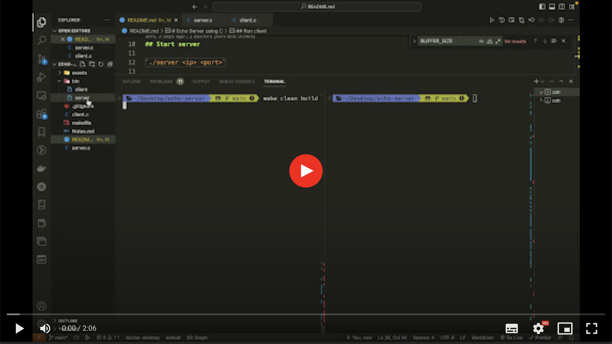
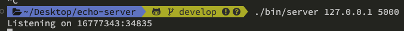
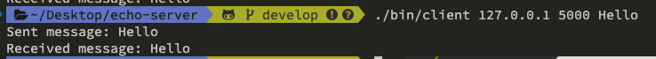
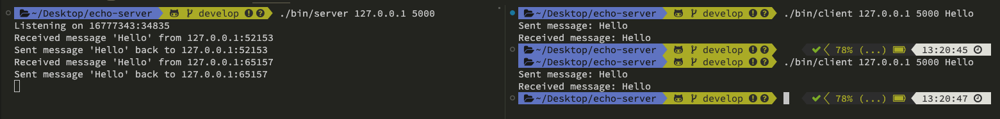
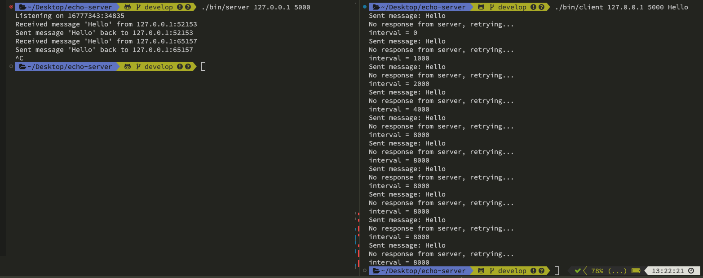

# Echo Server using C
An echo server program. Can listen to UDP messages on specific IP and port and reply a same message back to the client.

Demo video : https://drive.google.com/file/d/19mc1pOpWGP7KSwdaHvlrofD8JuqNdQYx/view?usp=share_link

[](https://drive.google.com/file/d/19mc1pOpWGP7KSwdaHvlrofD8JuqNdQYx/preview)

## Build Code
Generate 2 files under `bin` folder: `server` and `client`

```sh
make clean build
```

## Start server

`./server <ip> <port>`

Example:
```sh
./bin/server 127.0.0.1 5000 Hello
```


## Run client

`./client <ip> <port> <message>`

Example:
```sh
./bin/client 127.0.0.1 5000 Hello
```


## Demo

Send successfully


Retry


# Reference
* https://www.geeksforgeeks.org/udp-client-server-using-connect-c-implementation/?ref=gcse
* [C++ : : NETWORKING : : THREADED ECHO SERVER](https://cppsecrets.com/users/2194110105107104105108981049711648504964103109971051084699111109/C00-Networking-Threaded-echo-server.php)
* [TCP socket select用法分析](https://blog.csdn.net/u014530704/article/details/72833186)
* [Better Retries with Exponential Backoff and Jitter](https://www.baeldung.com/resilience4j-backoff-jitter)
* [tornado常见socket报错](https://www.jianshu.com/p/a7762d8c9973)
* [htonl(), ntohl(), htons(), ntohs() 函数具体应用](https://blog.csdn.net/u010355144/article/details/44964181)